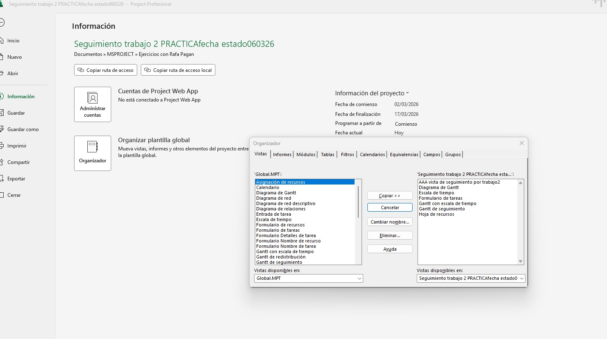
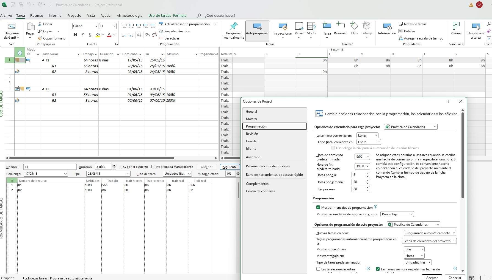
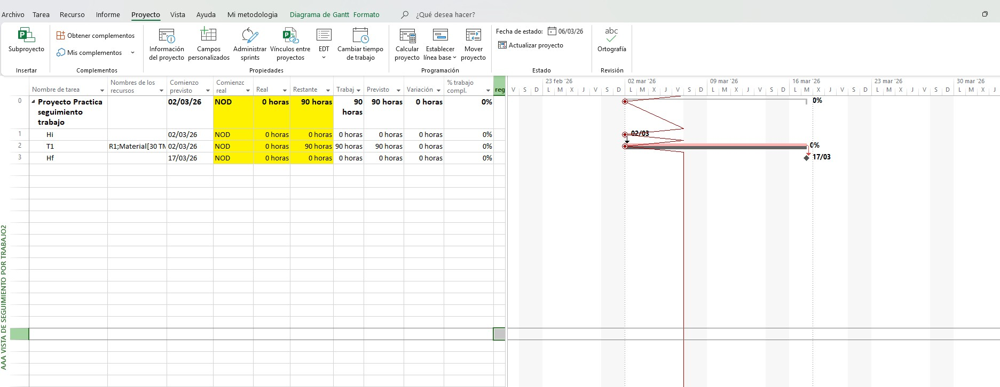
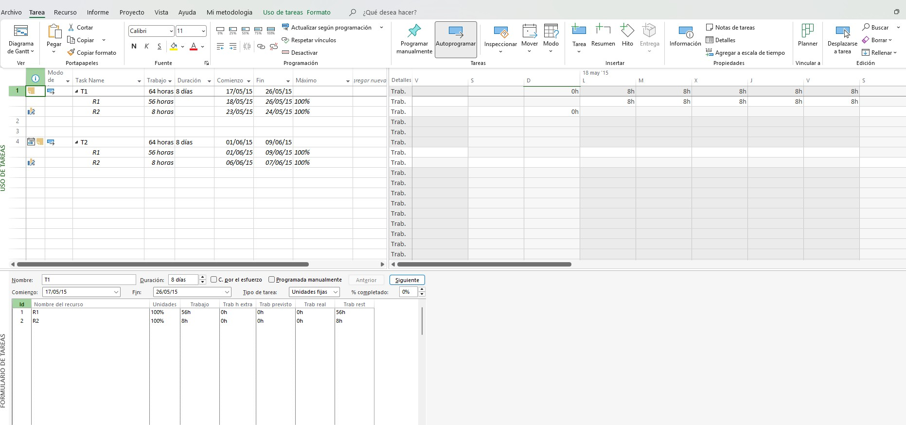
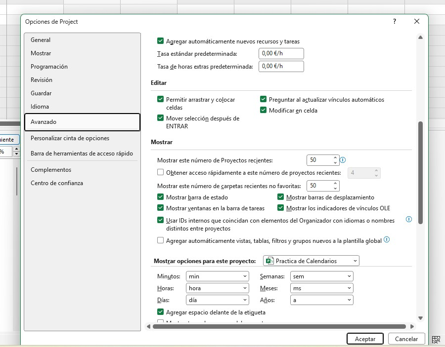

El uso de una Plantilla global permite que cualquier Project Manager de la empresa pueda abrir este archivo y entender los indicadores de rendimiento de inmediato, eliminando la curva de aprendizaje y errores de interpretación.

Creacion de Vistas personalizadas que puedo compartir en distintos proyectos añadiendola en mi proyecto a traves de la plantilla Global. En este proyecto he creado una que empiezan para diferenciarlas de las otras por AAA

Calendarios Personalizados: Configuración de jornadas laborales y festivos para obtener fechas de fin realistas y alineadas con la disponibilidad del equipo.

Fecha de Estado (Status Date): Uso de fechas de corte(06/03/2026) para separar el trabajo completado del pendiente, permitiendo un análisis preciso del Valor Acumulado (EVM).

Distintas vistas de MSProject con uso de tareas , formulario de tareas donde asignamos los recursos.

Ajustes en la configuracion personalizada en MSproject, desde cambio de formatos, monedas y parametros de dias , semanas y año.

